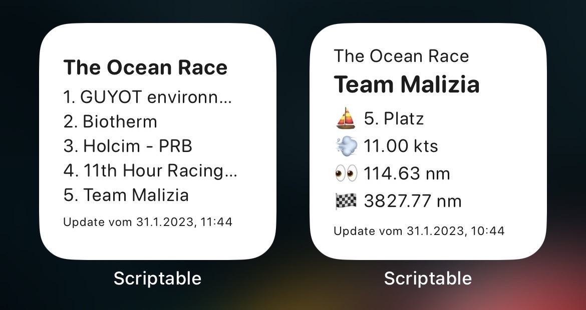
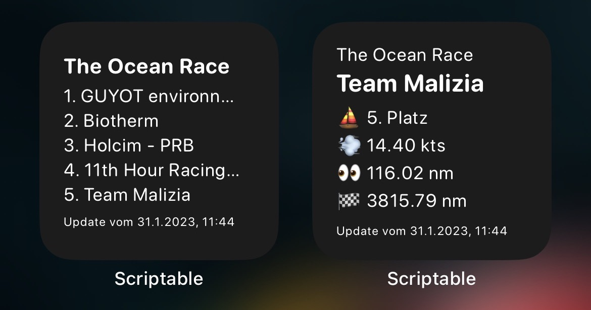
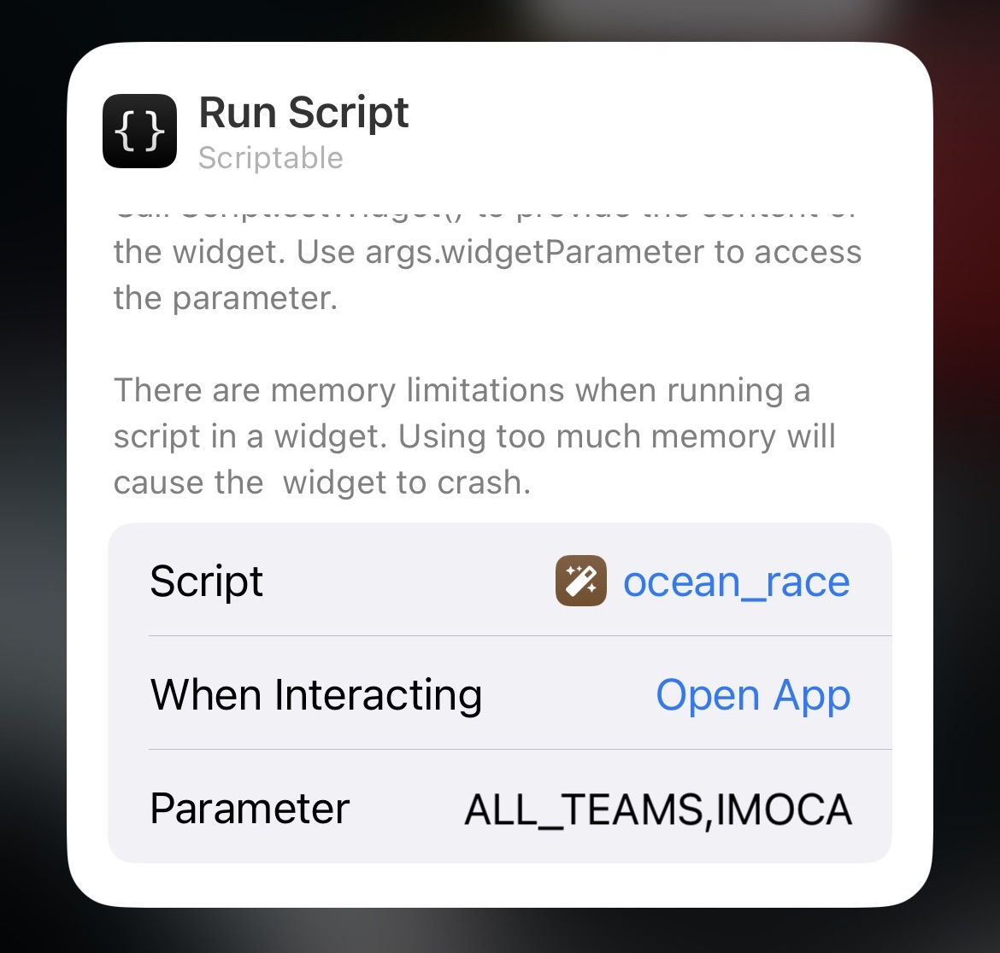

# The Ocean Race 2023 Homescreen Widget for Scriptable.app

A [scriptable.app](https://scriptable.app/) widget to get the latest update of [The Ocean Race](https://www.theoceanrace.com/) on your homescreen.

The default view is the team view of the [Team Malizia](https://www.team-malizia.com/).




## Features

- Select by team of each category and get information about the rank, speed, distance to the next position and distance to the finish
- Select by category and get the teams in ranked order
- Configure the options via the widget parameter, without touching the script
- Configuration via the widget parameters enable the widget to put as many widget on the homescreen as you want
- It has light- and darkmode (depending on device setting)
- Basic strings are available in english and german (depending on device setting)

## Configuration via parameters

Press long-tab on the widget and select "Edit Widget". You'll see a section with "Parameters", there it's possible to configure the widget (further down, there is a video available how to add and configure a widget).



The first value is the type of the widget, either "TEAMS" or "ALL_TEAMS", followed by either the category "IMOCA" or "VO65" or the teams code:

```
GUYO
BIOT
HOLC
11TH
MALI

AUST
WHIS
JAJO
BALT
MIRU
MEXI
```

seperated by a comma (`,`).

### Example

Let the widget display the ranking order of the Imocas, the parameter has to be:

```
ALL_TEAMS,IMOCA
```

Let the widget display the ranking order of the VO65, the parameter has to be:

```
ALL_TEAMS,VO65
```

Let the widget display the team Malizia:

```
TEAM,MALI
```

## Configure parameters inline

Of course, you're free to change the parameters in the script too. Default parameters are placed at the top of the script and can be
changed easily. Feel free to do so, but you'll loose the ability to put as many widget on your home screen as you want, except you
create for each case a new script (copy & paste again).

## Example recording how to add the widget and configure it
https://user-images.githubusercontent.com/1436744/215749451-0315eb47-1997-49bc-be8f-ebc90cc88e5f.mp4

## Update the script

Simply copy & paste the latest version of the script.

## Scriptable.app Installation

1. Download scriptable.app
1. Open the app and create a new script
1. Copy & paste the code of the [`widget.js`](https://raw.githubusercontent.com/johannesbraeunig/ocean_race_scriptable_widget/main/widget.js) to the scriptable script and save
1. Go to your homescreen and add a new widget
1. Select "Scriptable" and add the widget
1. Long press on the newly created widget and select the just created script, configure the parameters and confirm

## Warning
Use at your own risk!
